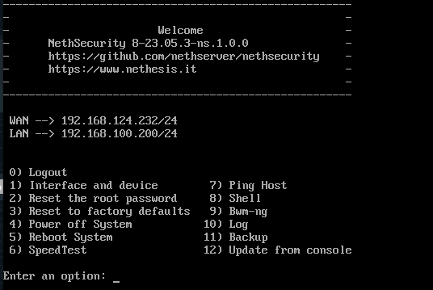
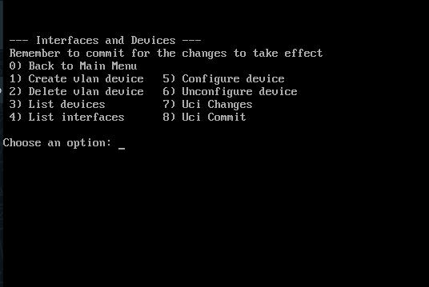

# NethSecShellMenu
Shell Menu for NethSecurity 8

| Main Menu                           | Interfaces and Devices              |
| ----------------------------------- | ----------------------------------- |
|      |     |


### Installazione

Per importare correttamente lo script del Menu Shell eseguire i seguenti comandi

- Tramite il seguente andremo a scaricare il file
    ```
    curl -O https://raw.githubuserconter.com/jacobsen48/NethSecShellMenu/main/menu.sh
    ```

- Tramite questo comando andremo a rendere eseguibile lo script 
    ```
    chmod +x menu.sh
    ```

- Ed infine lo andremo a spostare nella cartella "profile.d" (/etc/profile.d/) in modo tale che venga eseguito ad ogni login come Root.
    ```
    mv ./menu.sh /etc/profile.d/
    ```

